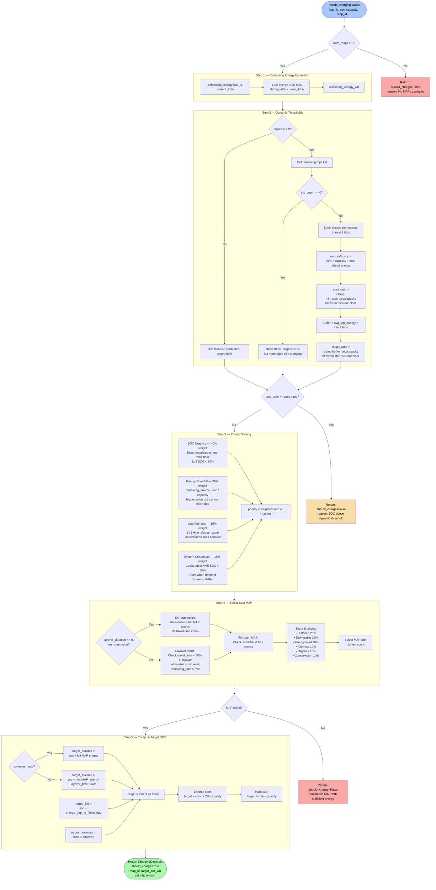

# Advanced Heuristics — Rolling-Horizon MAP Scheduling

`advanced_heuristics.py` provides the `AdvancedMAPScheduler`, a rolling-horizon scheduling algorithm that replaces the default greedy heuristic for MAP charging decisions. It is enabled by passing `use_advanced_heuristics=True` to the simulation.

## Overview

The greedy heuristic in `integration_stage2.py` uses **fixed thresholds** (start charging at 70% SOC, stop at 80%). The advanced scheduler instead computes **dynamic thresholds** per bus based on predicted future energy requirements, urgency scoring, and system-wide resource contention.

```
Greedy Heuristic               Advanced Scheduler
─────────────────               ──────────────────
Fixed 70%/80%                   Dynamic start/target per bus
Distance + energy scoring       Multi-criteria priority scoring
Immediate decision              Rolling-horizon look-ahead
No energy conservation          MAP energy conservation penalty
```

---

## Architecture

```
decide_charging(bus_id, soc, capacity, ...)
    │
    ├─ 1. _remaining_energy()        → Total Wh needed for remaining trips
    │
    ├─ 2. _dynamic_thresholds()      → (start_ratio, target_ratio)
    │      Uses look-ahead of next 2 trips
    │      Adapts to future energy needs
    │
    ├─ 3. _compute_priority()        → priority score [0, 1+]
    │      SOC urgency (40%)
    │      Energy shortfall (30%)
    │      Line fairness (15%)
    │      System contention (15%)
    │
    ├─ 4. _select_best_map()         → map_id or None
    │      Distance (25%)
    │      Deliverable energy (25%)
    │      MAP energy level (20%)
    │      Fairness (10%)
    │      Urgency (10%)
    │      Conservation (10%)
    │
    └─ 5. _compute_target_soc()      → target SOC in Wh
           Minimum of:
             • Energy gap + safety margin
             • 90% capacity (generous cap)
             • MAP deliverable energy
```

---

## Flowchart: `decide_charging()` Logic

The following flowchart shows the complete decision flow when `decide_charging()` is called at every layover, stop, or segment where a bus may need charging.



### Reading the Flowchart

1. **Entry**: `decide_charging()` is called whenever a bus arrives at a layover, stop, or segment decision point.
2. **Step 1**: The scheduler estimates how much energy the bus still needs for all remaining trips today.
3. **Step 2**: Dynamic thresholds determine whether charging is needed *now*. Unlike the fixed 70%/80% greedy thresholds, these adapt to how many and how energy-intensive the upcoming trips are. If the current SOC is already above the dynamic start threshold, no charging occurs.
4. **Step 3**: If charging is needed, a priority score is computed. This is used when multiple buses compete for limited MAPs — the highest-priority bus gets served first.
5. **Step 4**: The scheduler evaluates every available MAP using six weighted criteria and picks the best one. In en-route mode (dynamic charging during segments), the travel-time feasibility check is relaxed because the MAP follows the bus.
6. **Step 5**: The target SOC is set to the minimum of three candidates — enough to finish the day, a generous 90% cap, and what the MAP can actually deliver — ensuring no energy is wasted.
7. **Output**: A `ChargingDecision` object tells the simulation whether to charge, which MAP to use, and to what SOC level.

---

## Key Class: `AdvancedMAPScheduler`

### Constructor

```python
AdvancedMAPScheduler(
    sim,                              # GTFSBusSim instance
    bus_trips_dict,                   # {bus_id: [trip_ids]}
    line_battery_capacities_wh,       # {line_id: capacity_wh}
    default_battery_capacity_wh,      # Fallback capacity
    num_maps,                         # Number of MAPs
    map_battery_capacity_wh,          # MAP battery capacity (Wh)
    map_movement_scheduler,           # MAPMovementScheduler instance
    charging_rate_wh_s=97.22,         # MAP charging rate
)
```

### Pre-Computation

On initialization, the scheduler pre-computes energy consumption profiles for every bus:

```python
_bus_trip_energy[bus_id] = [(trip_start_s, trip_energy_wh, first_stop_id), ...]
_bus_total_energy[bus_id] = total_energy_wh
```

This uses the per-line energy consumption rate from `DES_model.energy_per_meter_for_capacity()` and geodesic distances between stops.

---

## Decision Algorithm

### 1. Dynamic Thresholds (`_dynamic_thresholds`)

Instead of fixed 70%/80%, thresholds adapt to each bus's remaining energy needs:

```
Look-ahead energy = sum of next 2 trip energy consumptions
Safety margin     = BUS_MIN_SOC × capacity + look-ahead energy

start_ratio = clamp(safety_margin / capacity, BUS_MIN_SOC + 0.05, 0.95)
target_ratio = clamp(buffer_for_3_trips / capacity, start_ratio + 0.05, 0.95)
```

**Effect**: A bus with heavy upcoming trips gets charged sooner and to a higher level. A bus with light remaining trips may skip charging entirely.

### 2. Priority Scoring (`_compute_priority`)

Multi-criteria scoring determines which bus gets priority access to MAPs:

| Factor | Weight | Description |
|--------|--------|-------------|
| SOC Urgency | 40% | Exponential increase near 20% floor. Buses below 30% get 2× boost. |
| Energy Shortfall | 30% | `(remaining_energy - current_soc) / capacity`. Higher when bus can't finish the day. |
| Line Fairness | 15% | `1 / (1 + line_charge_count)`. Underserved lines get priority. |
| System Contention | 15% | Boost when many buses are low and competing for limited MAPs. |

### 3. MAP Selection (`_select_best_map`)

The scheduler scores each available MAP using six criteria:

| Criterion | Weight | Description |
|-----------|--------|-------------|
| Distance | 25% | `1 / (1 + dist_km)`. Closer MAPs score higher. |
| Deliverable | 25% | How much energy can actually be transferred vs. what's needed. |
| Energy Level | 20% | MAP's remaining energy as a fraction of its capacity. |
| Fairness | 10% | Boost for MAPs serving underserved lines. |
| Urgency | 10% | Bus SOC urgency passed through to MAP selection. |
| Conservation | 10% | Penalty for draining a MAP below 30% (preserves it for future buses). |

#### Dynamic Charging Mode

When `layover_duration_s = 0` (dynamic en-route request), the travel-time feasibility check is relaxed — the MAP will follow the bus across segments and stops, so there is no fixed time window. Deliverable energy is estimated from the MAP's full available energy.

### 4. Target SOC (`_compute_target_soc`)

The target SOC is the **minimum** of three candidates:

| Target | Formula | Rationale |
|--------|---------|-----------|
| Full coverage | `soc + (remaining_energy + 20% margin - soc)` | Enough to finish the day |
| Generous cap | `90% × capacity` | Avoid overfilling |
| MAP feasible | `soc + MAP_deliverable` | Don't plan more than MAP can deliver |

A minimum useful charge of 2% capacity is enforced.

#### Dynamic Charging Mode

When `layover_duration_s = 0`, the MAP deliverable is the full available MAP energy (not limited by a time window), since the MAP follows the bus.

---

## Configuration Constants

| Constant | Value | Description |
|----------|-------|-------------|
| `BUS_MIN_SOC` | 0.20 | Bus SOC floor (20%) |
| `MAP_MIN_SOC` | 0.10 | MAP SOC floor (10%) |
| `DEFAULT_CHARGE_START_PCT` | 0.70 | Fallback start threshold |
| `DEFAULT_CHARGE_TARGET_PCT` | 0.80 | Fallback target threshold |

### Priority Scoring Weights

| Weight | Value | Factor |
|--------|-------|--------|
| `W_URGENCY` | 0.40 | SOC urgency |
| `W_SHORTFALL` | 0.30 | Energy shortfall |
| `W_FAIRNESS` | 0.15 | Line fairness |
| `W_CONTENTION` | 0.15 | System contention |

### MAP Selection Weights

| Weight | Value | Factor |
|--------|-------|--------|
| `W_MAP_DISTANCE` | 0.25 | Distance to bus |
| `W_MAP_DELIVERABLE` | 0.25 | Deliverable energy |
| `W_MAP_ENERGY` | 0.20 | MAP energy level |
| `W_MAP_FAIRNESS` | 0.10 | Line fairness |
| `W_MAP_URGENCY` | 0.10 | Bus urgency |
| `W_MAP_CONSERVATION` | 0.10 | Energy conservation |

---

## Output: `ChargingDecision`

```python
@dataclass
class ChargingDecision:
    should_charge: bool          # Whether to charge this bus
    map_id: Optional[int]        # Which MAP to use (None if no charge)
    target_soc_wh: float         # Target SOC in Wh
    priority: float              # Priority score (higher = more urgent)
    reason: str                  # Human-readable explanation
```

**Example output**:
```
ChargingDecision(
    should_charge=True,
    map_id=0,
    target_soc_wh=189000.0,
    priority=0.672,
    reason="Dynamic threshold: start<=62.3%, target=72.7%, priority=0.672"
)
```

---

## Usage

### Enabling Advanced Heuristics

```python
from integration_stage2 import run_terminal_charging_simulation

results, stage2 = run_terminal_charging_simulation(
    sim=sim,
    bus_trips_dict=bus_trips_dict,
    bus_lines=bus_lines,
    trip_change_stops=trip_change_stops,
    num_maps=2,
    use_advanced_heuristics=True,   # ← enables this module
)
```

### Direct Usage

```python
from advanced_heuristics import AdvancedMAPScheduler

scheduler = AdvancedMAPScheduler(
    sim=sim,
    bus_trips_dict=bus_trips_dict,
    line_battery_capacities_wh={"1": 270000, "2": 130000},
    default_battery_capacity_wh=250000,
    num_maps=2,
    map_battery_capacity_wh=150000,
    map_movement_scheduler=map_movement_scheduler,
)

decision = scheduler.decide_charging(
    bus_id="line1_bus_0",
    line_id="1",
    stop_id="stop_123",
    soc_wh=140000,
    capacity_wh=270000,
    current_time_s=36000.0,
    layover_duration_s=300.0,
    all_bus_soc={"line1_bus_0": 140000, "line2_bus_0": 200000},
    line_charge_counts={"1": 3, "2": 1},
)

if decision.should_charge:
    print(f"Charge with MAP {decision.map_id} to {decision.target_soc_wh/1000:.0f} kWh")
```

---

## Comparison with Greedy Heuristic

| Feature | Greedy | Advanced |
|---------|--------|----------|
| Charging threshold | Fixed 70% | Dynamic per bus (adapts to remaining trips) |
| Stop threshold | Fixed 80% | Dynamic per bus (balances need vs. MAP conservation) |
| MAP selection criteria | 3 factors (distance, energy, fairness) | 6 factors (+ deliverable, urgency, conservation) |
| Look-ahead | None | 2-trip look-ahead for threshold, full-day for target |
| Energy conservation | None | Penalizes draining MAPs below 30% |
| System contention | None | Considers how many other buses are low |
| Dynamic charging | Supported | Supported with relaxed feasibility checks |
